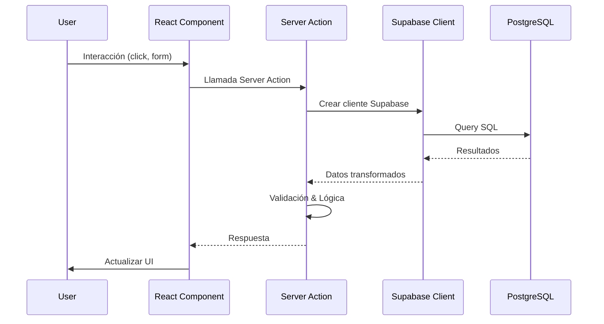

# Doit 🍰

**Finanzas simplificadas para pastelerías**

Doit es una aplicación web completa diseñada específicamente para la gestión financiera y operativa de pastelerías y reposterías. Permite gestionar inventario, órdenes, recetas y generar reportes financieros en tiempo real.

## 📋 Resumen del Proyecto

Doit es una plataforma SaaS que ayuda a los dueños de pastelerías a:

- **Gestionar Inventario Inteligente**: Controla ingredientes y productos terminados con alertas de stock bajo en tiempo real
- **Administrar Órdenes Automáticamente**: Crea y rastrea órdenes de clientes, actualiza el stock automáticamente al completar pedidos
- **Libro de Recetas Digital**: Conecta recetas con inventario y calcula automáticamente costos y rendimientos
- **Reportes en Tiempo Real**: Dashboards con indicadores clave y reportes exportables para decisiones basadas en datos

### Características Principales

- ✅ Gestión completa de ingredientes con control de stock
- ✅ Sistema de órdenes con vista de calendario
- ✅ Recetas digitales vinculadas al inventario
- ✅ Cálculo automático de costos de recetas
- ✅ Alertas de stock bajo considerando órdenes pendientes
- ✅ Dashboard con estadísticas en tiempo real
- ✅ Autenticación segura con Supabase
- ✅ Interfaz responsive y moderna

## 🛠️ Tech Stack

### Frontend

- **Framework**: [Next.js 15.5.3](https://nextjs.org/) (App Router)
- **UI Library**: [React 19](https://react.dev/)
- **Lenguaje**: [TypeScript 5](https://www.typescriptlang.org/)
- **Estilos**: [Tailwind CSS 4](https://tailwindcss.com/)
- **Componentes UI**: [Radix UI](https://www.radix-ui.com/)
- **Iconos**: [Lucide React](https://lucide.dev/)
- **Notificaciones**: [Sonner](https://sonner.emilkowal.ski/)
- **Fechas**: [date-fns](https://date-fns.org/)

### Backend

- **Server Actions**: Next.js Server Actions
- **Base de Datos**: [Supabase](https://supabase.com/) (PostgreSQL)
- **Autenticación**: Supabase Auth
- **ORM/Query Builder**: Supabase Client

### Desarrollo

- **Package Manager**: [pnpm](https://pnpm.io/)
- **Linting**: ESLint
- **Formatting**: Prettier
- **Git Hooks**: Husky + lint-staged
- **Build Tool**: Turbopack

## 🏗️ Arquitectura


### Flujo de Datos



### Estructura de Carpetas

```
src/
├── app/                    # Next.js App Router
│   ├── actions/           # Server Actions (lógica de negocio)
│   │   ├── orders.ts      # Gestión de órdenes
│   │   ├── ingredients.ts # Gestión de ingredientes
│   │   ├── recipes.ts     # Gestión de recetas
│   │   └── ...
│   ├── auth/              # Rutas de autenticación
│   ├── dashboard/         # Rutas del dashboard
│   └── page.tsx           # Landing page
│
├── components/            # Componentes React
│   ├── ui/               # Componentes base (Radix UI)
│   ├── dashboard/        # Componentes del dashboard
│   ├── inventory/        # Componentes de inventario
│   ├── orders/           # Componentes de órdenes
│   └── recipes/          # Componentes de recetas
│
├── lib/                  # Utilidades y configuraciones
│   ├── supabase/         # Clientes de Supabase
│   ├── hooks/            # Custom hooks
│   └── types/            # TypeScript types
│
└── middleware.ts         # Middleware de Next.js
```

## 🚀 Getting Started

### Prerrequisitos

- Node.js 18+
- pnpm instalado globalmente
- Cuenta de Supabase (para base de datos)

### Instalación

1. **Clonar el repositorio**

```bash
git clone <repository-url>
cd doit
```

2. **Instalar dependencias**

```bash
pnpm install
```

3. **Configurar variables de entorno**

Crea un archivo `.env.local` en la raíz del proyecto:

```env
NEXT_PUBLIC_SUPABASE_URL=your_supabase_url
NEXT_PUBLIC_SUPABASE_ANON_KEY=your_supabase_anon_key
```

4. **Ejecutar migraciones de base de datos**

Consulta `SUPABASE_SETUP.md` para configurar las tablas en Supabase.

5. **Iniciar servidor de desarrollo**

```bash
pnpm dev
```

6. **Abrir en el navegador**

Navega a [http://localhost:3000](http://localhost:3000)

## 📦 Scripts Disponibles

```bash
# Desarrollo
pnpm dev              # Inicia servidor de desarrollo con Turbopack

# Producción
pnpm build            # Construye la aplicación para producción
pnpm start            # Inicia servidor de producción

# Calidad de código
pnpm lint             # Ejecuta ESLint
pnpm format           # Formatea código con Prettier
```

## 🗄️ Base de Datos

### Tablas Principales

- **users**: Usuarios de la aplicación (manejado por Supabase Auth)
- **ingredients**: Ingredientes con stock y costos
- **recipes**: Recetas con título, precio y descripción
- **recipe_ingredients**: Relación entre recetas e ingredientes
- **orders**: Órdenes de clientes con fecha de entrega
- **order_items**: Items de cada orden (recetas y cantidades)

### Relaciones

```
users 1──N ingredients
users 1──N recipes
users 1──N orders

recipes N──M ingredients (via recipe_ingredients)
orders N──M recipes (via order_items)
```

## 🔐 Autenticación

La aplicación usa Supabase Auth con:

- Registro de usuarios
- Inicio de sesión
- Recuperación de contraseña
- Confirmación de email
- Middleware para proteger rutas

## 📱 Características Técnicas

### Server Actions

Toda la lógica de negocio está en Server Actions de Next.js, lo que permite:

- Type-safe API calls
- Validación en el servidor
- Revalidación automática de rutas
- Mejor seguridad (no expone endpoints públicos)

### Gestión de Estado

- Estado del servidor: Server Actions + React Server Components
- Estado del cliente: React hooks (useState, useMemo)
- Cache: Next.js revalidation + Supabase queries

### Optimizaciones

- Memoización con `useMemo` para cálculos costosos
- Lazy loading de componentes
- Optimización de imágenes con Next.js Image
- Revalidación selectiva de rutas
