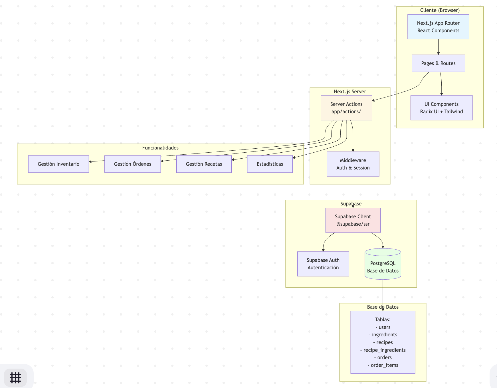
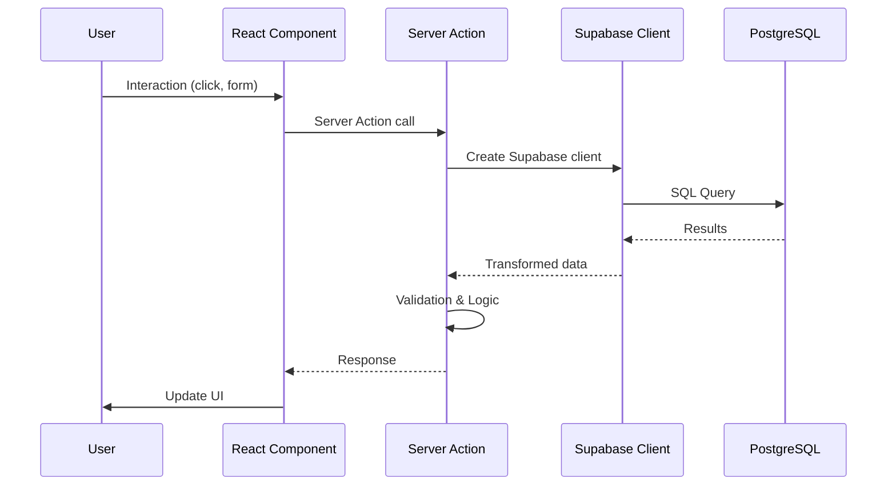

# Doit 🍰

**Simplified finances for bakeries**

Doit is a complete web application specifically designed for the financial and operational management of bakeries and pastry shops. It allows managing inventory, orders, recipes, and generating real-time financial reports.

## 📋 Project Summary

Doit is a SaaS platform that helps bakery owners to:

- **Smart Inventory Management**: Control ingredients and finished products with real-time low stock alerts
- **Automated Order Management**: Create and track customer orders, automatically update stock when completing orders
- **Digital Recipe Book**: Connect recipes with inventory and automatically calculate costs and yields
- **Real-Time Reports**: Dashboards with key indicators and exportable reports for data-driven decisions

### Main Features

- ✅ Complete ingredient management with stock control
- ✅ Order system with calendar view
- ✅ Digital recipes linked to inventory
- ✅ Automatic recipe cost calculation
- ✅ Low stock alerts considering pending orders
- ✅ Dashboard with real-time statistics
- ✅ Secure authentication with Supabase
- ✅ Responsive and modern interface

## 🛠️ Tech Stack

### Frontend

- **Framework**: [Next.js 15.5.3](https://nextjs.org/) (App Router)
- **UI Library**: [React 19](https://react.dev/)
- **Language**: [TypeScript 5](https://www.typescriptlang.org/)
- **Styling**: [Tailwind CSS 4](https://tailwindcss.com/)
- **UI Components**: [Radix UI](https://www.radix-ui.com/)
- **Icons**: [Lucide React](https://lucide.dev/)
- **Notifications**: [Sonner](https://sonner.emilkowal.ski/)
- **Dates**: [date-fns](https://date-fns.org/)

### Backend

- **Server Actions**: Next.js Server Actions
- **Database**: [Supabase](https://supabase.com/) (PostgreSQL)
- **Authentication**: Supabase Auth
- **ORM/Query Builder**: Supabase Client

### Development

- **Package Manager**: [pnpm](https://pnpm.io/)
- **Linting**: ESLint
- **Formatting**: Prettier
- **Git Hooks**: Husky + lint-staged
- **Build Tool**: Turbopack

## 🏗️ Architecture



### Data Flow



### Folder Structure

```
src/
├── app/                    # Next.js App Router
│   ├── actions/           # Server Actions (business logic)
│   │   ├── orders.ts      # Order management
│   │   ├── ingredients.ts # Ingredient management
│   │   ├── recipes.ts     # Recipe management
│   │   └── ...
│   ├── auth/              # Authentication routes
│   ├── dashboard/         # Dashboard routes
│   └── page.tsx           # Landing page
│
├── components/            # React components
│   ├── ui/               # Base components (Radix UI)
│   ├── dashboard/        # Dashboard components
│   ├── inventory/        # Inventory components
│   ├── orders/           # Order components
│   └── recipes/          # Recipe components
│
├── lib/                  # Utilities and configurations
│   ├── supabase/         # Supabase clients
│   ├── hooks/            # Custom hooks
│   └── types/            # TypeScript types
│
└── middleware.ts         # Next.js middleware
```

## 🚀 Getting Started

### Prerequisites

- Node.js 18+
- pnpm installed globally
- Supabase account (for database)

### Installation

1. **Clone the repository**

```bash
git clone <repository-url>
cd doit
```

2. **Install dependencies**

```bash
pnpm install
```

3. **Configure environment variables**

Create a `.env.local` file in the project root:

```env
NEXT_PUBLIC_SUPABASE_URL=your_supabase_url
NEXT_PUBLIC_SUPABASE_ANON_KEY=your_supabase_anon_key
```

4. **Run database migrations**

See `SUPABASE_SETUP.md` to configure tables in Supabase.

5. **Start development server**

```bash
pnpm dev
```

6. **Open in browser**

Navigate to [http://localhost:3000](http://localhost:3000)

## 📦 Available Scripts

```bash
# Development
pnpm dev              # Start development server with Turbopack

# Production
pnpm build            # Build application for production
pnpm start            # Start production server

# Code quality
pnpm lint             # Run ESLint
pnpm format           # Format code with Prettier
```

## 🗄️ Database

### Main Tables

- **users**: Application users (managed by Supabase Auth)
- **ingredients**: Ingredients with stock and costs
- **recipes**: Recipes with title, price and description
- **recipe_ingredients**: Relationship between recipes and ingredients
- **orders**: Customer orders with delivery date
- **order_items**: Items for each order (recipes and quantities)

### Relationships

```
users 1──N ingredients
users 1──N recipes
users 1──N orders

recipes N──M ingredients (via recipe_ingredients)
orders N──M recipes (via order_items)
```

## 🔐 Authentication

The application uses Supabase Auth with:

- User registration
- Login
- Password recovery
- Email confirmation
- Middleware to protect routes

## 📱 Technical Features

### Server Actions

All business logic is in Next.js Server Actions, which enables:

- Type-safe API calls
- Server-side validation
- Automatic route revalidation
- Better security (doesn't expose public endpoints)

### State Management

- Server state: Server Actions + React Server Components
- Client state: React hooks (useState, useMemo)
- Cache: Next.js revalidation + Supabase queries

### Optimizations

- Memoization with `useMemo` for expensive calculations
- Lazy loading of components
- Image optimization with Next.js Image
- Selective route revalidation
